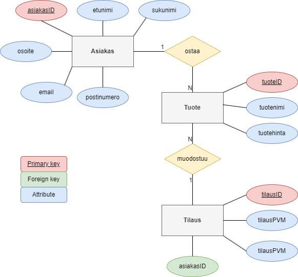

# Verkkokaupan Tietokanta

Harjoitustyönä tein yksinkertaisen tietokannan, sekä tietokannan käyttöliittymän python kielellä, verkkokaupan pyörittämistä varten. Käyttöliittymä mahdollistaa tietyt hallinnointi toiminnallisuudet (hallinta_UI), sekä tietyt kyselytoiminnallisuudet kysely_UI. Muista ajaa pipinstallit.ipynb, jotta tarvittavat riippuvuudet ovat asennettuna. Betaversion kansiosta löytyy aiempi versio tästä harjoitustyöstä, ennen kuin aloin hyödyntämään luokkia. Omasta mielestä projektia voisi lähteä laajentamaan visuaalisemmaksi esimerkiksi tekemällä erilaisia kaavioita kyselyiden pohjalta, mutta ajan puutteen vuoksi en syvälle vielä kerennyt, myös tilauksen tekemisen käyttöliittymässä olisi kehitettävää, mutta se on nyt riittävän hyvä tähän tarkoitukseen.

# Harjoitustyön toimintasuunnitelma

## Ympäristön valmistelu (riippuvuuksien lataus) (OSA 1)

    - !pip install pymysql
    - !pip install ipython-sql
    - !pip3 install mysqlclient
    - !pip3 install mysql-connector-python
    - !pip install pandas
        - import pymysql
        - import mysql.connector as database
        - import pandas as pd

## Tietokannan suunnittelu ja luominen (OSA 2)

- [x] Luo tietokanta
- [x] Luo Asiakas taulu
- [x] Luo Tuote taulu
- [x] Luo Tilaus taulu

## Taulujen toiminnallisuus (OSA 3)

- [x] Mahdollista Asiakkaan tietojen syöttäminen
- [x] Mahdollista Asiakkaan tietojen lukeminen
- [x] Mahdollista Asiakkaan tietojen muokkaaminen
- [x] Mahdollista Asiakkaan poistaminen
- [x] Mahdollista Tuotteiden syöttäminen
- [x] Mahdollista Tuotteiden lukeminen
- [x] Mahdollista Tuotteen poistaminen

## Tilaus taulun toiminnallisuus (OSA 4)

- [x] Kun asiakas ostaa tuotteen, muodostuu tilausnumero ja aikaleima
- [x] Tee uusi ER kaavio projektille, lisätty uusia recordeja

## Turvallisuus (OSA 5)

- [x] Jaa ohjelmakoodit luokkiin, jonka seurauksena käyttöliittymässä ei näy ohjelmakoodia

## Tietokannan testaus ja korjaustoimenpiteet (OSA 6)

- [x] Testaa tietokantaa tarvittavan toiminnallisuuden saavuttamiseksi ja tee tarvittaessa korjaukset
