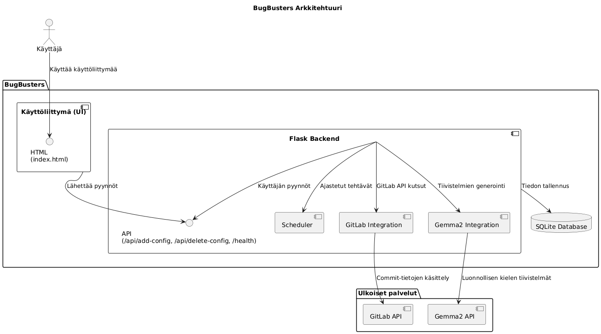
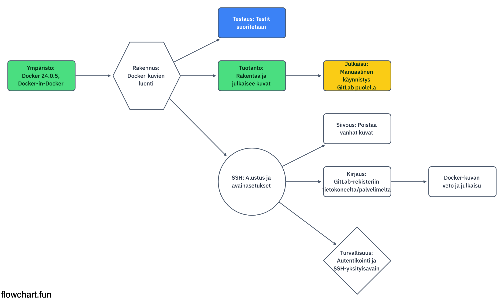

# BugBusters Project (20241127)

[toc]

## Projektin kuvaus
BugBusters on GitLab commit -tulkki, joka kirjaa dokumentaatiohaaraan automaattisesti tiivistelmiä koodimuutoksista. Palvelu käyttää luonnollista kieltä (suomea) selittämään koodin muutoksia ja auttaa näin seuraamaan projektin kehitystä.

## Käyttöliittymä
Käyttöliittymä on osoitteessa `http://127.0.0.1:8080`. Käyttäjä voi syöttää:
1. GitLab-repositorion ID:n
2. Tokenin, jolla on tarvittavat oikeudet

Käyttäjä voi myös poistaa syöttämiään projekteja helposti.

## Palvelun tavoite ja toiminnot
BugBusters-palvelu hyödyntää [Gemma2-mallia](https://ollama.ai/gemma2) diff-tiivistelmien generoinnissa. Palvelu tarjoaa seuraavat toiminnot:
1. **Haarojen ja commitien tarkistus:** Palvelu hakee määritetyiltä haaroilta uudet commitit ja analysoi niiden sisällön.
2. **Diff-tiivistelmien luominen:** Generoidaan suomenkielisiä tiivistelmiä koodimuutoksista käyttäen Gemma2-mallia.
3. **Dokumentaation päivittäminen:** Commit-tiivistelmät tallennetaan dokumentaatiohaaraan (esim. `commits_{branch_name}.md`).
4. **Projektin hallinta:** Käyttäjä voi lisätä tai poistaa projekteja käyttöliittymän kautta.
5. **Aikaleiman hallinta:** Commitien tarkistus perustuu tallennettuun aikaleimaan, jotta käsittely on tehokasta.

## Projektin rakenne
```
## Tiedostorakenne

```plaintext
.
├── Dockerfile
├── README.md
├── app
│   ├── __pycache__
│   │   └── service.cpython-311.pyc
│   ├── db_setup.py            # Tietokannan alustamisskripti
│   ├── docker                 # Docker-konfiguraatioiden hakemisto
│   ├── service copy.py        # Palvelun varmuuskopio- tai testiversio
│   ├── service.py             # Pääpalveluskripti, jossa Flask-sovellus
│   ├── start.sh               # Sovelluksen käynnistysskripti
│   └── templates
│       └── index.html         # Käyttöliittymän HTML-pohja
├── deploy.sh                  # Sovelluksen julkaisuskripti
├── docker_temp
│   └── config.db              # Väliaikainen SQLite-tietokantatiedosto
├── infra.png                  # Sovelluksen infrastruktuurin kaavio
├── requirements.txt           # Python-riippuvuudet
└── tests
    ├── conftest.py            # Pytest-konfiguraatiotiedosto
    └── test_service.py        # Palvelun toiminnallisuuden yksikkötestit
```

## Käyttöohjeet

### Esivaatimukset
- Python 3.9+ (jos ei käytetä Dockeria)
- Docker
- Docker Compose
- Git
- Ollama CLI
- Gemma2-kielimalli

### Sovelluksen käyttöönotto

#### 1. Riippuvuuksien asennus ilman Dockeria
Jos haluat ajaa projektin suoraan koneellasi, asenna riippuvuudet:
```bash
pip install -r requirements.txt
```

#### 2. Docker-ympäristön rakentaminen ja käynnistys
Luo Docker-kontti projektin `Dockerfile`-tiedoston avulla:
```bash
docker build -t bugbusters .
```
Käynnistä kontti komennolla:
```bash
sh deploy.sh
```
Palvelu toimii osoitteessa `http://localhost:8080`.

#### 3. Flask-palvelimen käynnistys ilman Dockeria
Käynnistä palvelin suoraan koneellasi:
```bash
python app/service.py
```

## 1. Päivitä pakettivarastot

Varmista ensin, että järjestelmäsi ohjelmistot ovat ajan tasalla.

**macOS**:
```bash
softwareupdate -l
```
**Windows**: Käytä Windows Update -työkalua.

**Linux**: Suorita Linuxin terminaalissa:
```bash
sudo apt update
sudo apt upgrade -y
```

## 2. Asenna Docker

Docker mahdollistaa projektin ympäristön hallinnan.

**macOS**:
1. Lataa Docker Desktop osoitteesta [https://www.docker.com/products/docker-desktop](https://www.docker.com/products/docker-desktop)
2. Asenna ja seuraa asennusohjeita.

**Windows**:
1. Lataa Docker Desktop osoitteesta [https://www.docker.com/products/docker-desktop](https://www.docker.com/products/docker-desktop)
2. Asenna ja seuraa asennusohjeita.

**Linux**:
Suorita nämä vaiheet Linuxin terminaalissa:
1. Päivitä pakettivarastot
```bash
  sudo apt update
  sudo apt upgrade -y
```
2. Asenna työkalut
```bash
  sudo apt install -y apt-transport-https ca-certificates curl software-properties-common
```
3. Lisää Dockerin GPG-avain ja arkisto
```bash
  curl -fsSL https://download.docker.com/linux/ubuntu/gpg | sudo gpg --dearmor -o /usr/share/keyrings/docker-archive-keyring.gpg
echo “deb [arch=$(dpkg --print-architecture) signed-by=/usr/share/keyrings/docker-archive-keyring.gpg] https://download.docker.com/linux/ubuntu $(lsb_release -cs) stable” | sudo tee /etc/apt/sources.list.d/docker.list > /dev/null
```
4. Asenna Docker
```bash
  sudo apt update
  sudo apt install -y docker-ce docker-ce-cli containerd.io
```
5. Testaa Asennus
```bash
  docker --version
```
Dockerille ei ole omaa graafista käyttöliittymää (GUI) suoraan, mutta voidaan käyttää kolmannen osapuolen työkaluja, jotka tarjoavat graafisen käyttöliittymän Dockerin hallintaan. Yksi hyvä vaihtoehto on Portainer.

Tässä ohjeet Portainerin asentamiseen ja käyttöön Ubuntussa:

Portainer toimii Docker-konttina, joten sen asennus on kohtalaisen helppoa.

1. Lataa Portainerin kuva:
```bash
  docker pull portainer/portainer-ce 
```
2. Luo tilapäinen säilytystila Portainerille:
```bash
  docker volume create portainer_data  
```
3. Käynnistä Portainer-kontti:
```bash
  docker run -d -p 8000:8000 -p 9443:9443 --name=portainer --restart=always -v /var/run/docker.sock:/var/run/docker.sock -v portainer_data:/data portainer/portainer-ce
```
 
### Portainerin käyttö:

1. Avaa selaimessa Portainerin käyttöliittymä:
  - Mene osoitteeseen: https://localhost:9443 tai https://<koneesi_IP>:9443.
Jos käytät toista konetta, korvaa <koneesi_IP> Dockeria ajavan koneen IP-osoitteella.

2. Konfiguroi:
  - käyttäjätunnus ja salasana.
  - Valitse Docker, jota haluat käyttää


## 3. Asenna Ollama CLI ja Gemma 2 -kielimalli

**macOS**:
```bash
curl -sSL "https://ollama.com/cli/download" | bash
ollama pull gemma
```

**Windows**:
1. Lataa Ollama CLI osoitteesta [https://ollama.com](https://ollama.com)
2. Asenna ja varmista, että `ollama`-komento toimii komentoriviltä.
3. Lataa Gemma 2 -malli komennolla:
```bash
   ollama pull gemma
```

**Linux**
1. Avaa terminaali ja suorita seuraavat komennot järjestyksessä:
```bash
  curl -fsSL https://ollama.com/install.sh | sh
```
```bash
  ollama serve
```
```bash
  ollama pull gemma2:27b
```

## 4. Asenna Git

**macOS**:
```bash
brew install git
```

**Windows**:
1. Lataa ja asenna Git osoitteesta [https://git-scm.com/download/win](https://git-scm.com/download/win)

**Linux**

1. Avaa terminaali ja varmista, että järjestelmäsi on ajan tasalla:
```bash
sudo apt update
sudo apt upgrade -y
```
2. Asenna Git
```bash
sudo apt install git -y
```
3. Varmista asennus
```bash
git --version
```
4. Konfiguroi Git
```bash
git config --global user.name "Eetu Nimi"
git config --global user.email "sahkoposti@gitariassa.com"
```

## 5. Kloonaa projektin Git repository

Kloonaa projektin repository GitLabista paikalliselle koneelle.

```bash
git clone <repository-url>
```

## 6. Konfiguroi `config.yaml`

Luo projektin juurihakemistoon `config.yaml`-tiedosto ja lisää siihen GitLabin ja Ollama/Gemma asetukset. Esimerkki:

```yaml
gitlab:
  project_id: "123456"
  token: "your_gitlab_token"

ollama:
  model: "gemma"
```

7. Flask-palvelimen käynnistys ilman Dockeria (vaihtoehtoinen)
Jos haluat ajaa palvelun suoraan koneellasi ilman Dockeria, varmista että Python 3.9+ on asennettuna.

Asenna riippuvuudet:

```bash
pip install -r requirements.txt
Käynnistä palvelin:
```
```bash
python app/service.py
```

### Rajapinnat

#### Swagger-dokumentaatio

BugBusters käyttää [Swagger UI](https://swagger.io/tools/swagger-ui/):tä, joka mahdollistaa API-dokumentaation selaamisen ja testaamisen suoraan selaimessa.

#### Swaggerin käyttö
1. Käynnistä palvelu normaalisti Dockerin tai Pythonin avulla.
2. Avaa selaimessa `http://localhost:8080/swagger/`.
3. Swagger UI näyttää kaikki käytettävissä olevat API-reitit, niiden kuvaukset ja vaaditut parametrit.
4. Voit testata reittejä suoraan Swagger UI:n kautta.

#### Esimerkki Swagger UI -dokumentaatiosta

**Reitti**: `/api/add-config`

- **Kuvaus**: Lisää uuden GitLab-projektin ja tokenin tietokantaan.
- **Metodi**: POST
- **Parametrit**:
  - `repo` (string): GitLab-repositorion ID, esim. `example/repo`.
  - `token` (string): GitLab-token, jolla on oikeus lukea ja muokata tietoja.

#### Esimerkki JSON-pyynnöstä
```json
{
  "repo": "example/repo",
  "token": "example-token"
}
```
## Teknologiat ja riippuvuudet
Projektissa käytetään seuraavia teknologioita:
- [Flask](https://flask.palletsprojects.com/): Kevyt web-sovelluskehys.
- [SQLite](https://sqlite.org/): Helppokäyttöinen tietokanta.
- [Requests](https://requests.readthedocs.io/): HTTP-pyyntöjen hallinta.
- [Schedule](https://schedule.readthedocs.io/): Ajastustehtävien hallinta.
- [Gemma2](https://ollama.ai/gemma2): Luonnollisen kielen tiivistelmien generointi.

## SQLite-tietokannan käyttö
Tietokantaa voi tarkastella ja hallita suoraan Docker-kontin sisällä:
```bash
docker exec -it commit-summary-service bash
cd /app/docker
sqlite3 config.db
.tables
SELECT * FROM configurations;
.exit
DELETE FROM configurations WHERE id = 1;
.headers ON
.mode column


UPDATE configurations
SET last_checked = '2024-11-18T00:00:00+02:00'
WHERE id = 15;
```

Tietokannan käyttöesimerkkejä:
- Näytä kaikki konfiguraatiot:
```sql
  SELECT * FROM configurations;
```
- Lisää aikaleima tarkistukseen:
```sql
  UPDATE configurations SET last_checked = '2024-11-18T20:00:00Z' WHERE id = 1;
```
- Poista tietue:
```sql
  DELETE FROM configurations WHERE id = 1;
```
- Poistu tietokannasta:
```bash
  .exit
```
## Lokit ja virheidenhallinta
Kaikki palvelun toiminnot kirjataan lokiin. Virhetilanteissa voit tarkistaa palvelun toiminnan lokitiedostoista tai suoraan Docker-kontista:
```bash
docker logs bugbusters
```

## Kehityssuunnitelmat
1. Lisääntynyt tietoturva: Salaa tokenit tietokannassa.
2. Käyttäjäystävällisempi käyttöliittymä: Dynaamisempi ja responsiivinen UI.

## Testit
Käynnistä testit
```bash
pytest tests/
```

Asenna pytest
```bash
pip install pytest pytest-mock
```


## GitLab CI/CD Pipeline - Kuvaus

Tämä GitLab CI/CD -pipeline koostuu kahdesta päävaiheesta: rakennusvaihe (build) ja julkaisuvaihe (deploy-prod). Pipeline käyttää Docker-teknologiaa rakentamisen ja siirron toteuttamiseen.

### 1. **Yleiskatsaus**
- **Image & Services**: Käyttää Dockerin `docker:24.0.5` kuvaa ja Docker-in-Docker (dind) palvelua.
- **Before Script**: Alustavat komennot, jotka näyttävät Dockerin tiedot ja kirjautuvat Docker Registryyn.

### 2. **Vaiheet (Stages)**
- **Build**: Rakentaa Docker-kuvan sovelluksestasi.
- **Deploy-prod**: Siirtää valmiin kuvan tuotantoympäristöön.

### 3. **Build-vaihe**
- **Tehtävät**:
  - Rakentaa Docker-kuvan käyttäen `docker build` -komentoa.
  - Työntää rakennetun kuvan GitLabin Docker Registryyn komennolla `docker push`.

### 4. **Deploy-prod-vaihe**
- **Tehtävät**:
  - Valmistele SSH-yhteys käyttämällä `ssh-agent`, `ssh-add`, ja `ssh-keyscan`.
  - Synkronoi projektin tiedostot tuotantopalvelimelle käyttäen `rsync`.
  - Kirjaudu Docker Registryyn, poista vanhat kontit, ja käynnistä uusi kontti valitulla porttialueella (8080-8090). Jos portti on varattu, kokeilee seuraavaa porttia määritellyllä alueella.
  - Puhdistaa turhat Docker-kuvat.

### 5. **SSH-tunnelointi koulun palvelimelle**
- **Ohjeet**: Pääsy koulun palvelimelle tapahtuu SSH:n kautta. Yksityiskohtaiset yhteystiedot ja salasana löytyvät koulun Discord-kanavalta (projekti4 -> backend-tiimi (ihan ylhäällä :).



